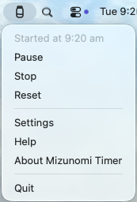

# Mizunomi Timer

Mizunomi Timer is a small macOS menu-bar utility that reminds you to drink water at a designated interval.

It is intentionally low-profile: there is no Dock icon, no main window, and no persistent drinking history. The app just shows a menu-bar icon and a quiet custom reminder panel on the desktop.

Mizunomi Timer is free and open-source. If you find it useful, [optional contributions are greatly appreciated](https://ko-fi.com/naohideyamamoto) and help cover ongoing maintenance costs. Contributions are voluntary and do not change the app’s functionality.

[](https://ko-fi.com/naohideyamamoto)

This document contains full details of Mizunomi Timer, many of which end-users do not need. [A brief user manual that lets you quickly start using the app is also available](https://naohide-yamamoto.github.io/mizunomi-timer/Resources/UserManual.html).

## Screenshots

 

## Requirements

- Apple Silicon Mac
- macOS Tahoe 26.4

No backward compatibility is planned for earlier macOS releases.

## Build Requirements

- Xcode 26.4.1 or newer
- Swift 6.3.1 or newer

## Behaviour

- The timer starts automatically when the app launches by default.
- A launch-time timer start and a custom start time are mutually exclusive settings.
- A custom start time can be set in Settings using hour, minute, and AM/PM controls.
- If the custom start time has already passed today, the app waits until that time tomorrow.
- Reminder timing is fixed from the start time. For example, with an 8:00 am start and a 60-minute interval, reminders appear at 9:00 am, 10:00 am, 11:00 am, and so on.
- Clicking OK records that you have had water.
- Clicking Skip records that you chose not to have water for that reminder.
- Letting the panel time out records that you did not respond to that reminder.
- If you skip one or more reminders, or do not respond to them, the next reminder reports how many minutes have passed without water.
- Pause preserves the original schedule and skips reminder display until Resume.
- Stop clears the running timer state and returns the menu item to Start.
- Reset stops the current timer and immediately starts a fresh timer from now.
- Interval history is kept in memory only and is reset when the app quits.

## Menu

The menu-bar menu contains:

- Start, replaced by `Started at 2:30 pm` after the timer starts
- Pause, replaced by Resume while paused
- Stop
- Reset
- Settings
- Help
- About Mizunomi Timer
- Quit

## Settings

Settings include:

- Start time
- Start timer at app launch
- Reminder interval, in minutes
- Reminder duration, in minutes
- Reminder panel width, height, display target, desktop location, fill colour, border colour, and text styling
- Launch at login
- Reset Settings

The default reminder interval is 60 minutes. The default reminder duration is 10 minutes. Both fields accept whole numbers only, and reminder duration must be shorter than the reminder interval. The default reminder display target is the main display.

## Help

The Help menu item opens the bundled user manual in your default web browser.

## Checking for Updates

Choose **About Mizunomi Timer** from the menu-bar menu and note the version shown there. Click **Check for Updates** to open the Mizunomi Timer releases page in your default browser, then compare your app version with the version marked as the latest release on GitHub.

If the GitHub release is newer, download the Mizunomi Timer ZIP file from [https://github.com/naohide-yamamoto/mizunomi-timer/releases](https://github.com/naohide-yamamoto/mizunomi-timer/releases), open the ZIP, and replace your installed copy of **Mizunomi Timer.app**. Mizunomi Timer does not download or install updates automatically.

## Build

Build the app bundle with:

```sh
bash scripts/build-app.sh
```

The built app is written to:

```text
build/Mizunomi Timer.app
```

For a debug build:

```sh
CONFIGURATION=debug bash scripts/build-app.sh
```

## Release

Public release builds should be signed with a Developer ID Application certificate, notarised by Apple, and stapled before distribution.

First, store notarisation credentials in Keychain:

```sh
xcrun notarytool store-credentials "mizunomi-timer-notary" \
  --apple-id "you@example.com" \
  --team-id "TEAMID"
```

When prompted, enter the app-specific password for your Apple Account.

Do not commit Apple ID credentials, app-specific passwords, API keys, or Team IDs as secrets.

Then create a signed and notarised release ZIP:

```sh
SIGNING_IDENTITY="Developer ID Application: Your Name (TEAMID)" \
NOTARY_PROFILE="mizunomi-timer-notary" \
bash scripts/release-app.sh
```

The release ZIP is written to:

```text
build/release/
```

The release script also creates a SHA256 checksum file in the same directory.

## Local Git Hooks

Optional local Git hooks help prevent private signing material, notarisation credentials, local-only notes, and build/release artefacts from being committed or pushed accidentally.

Install them with:

```sh
bash scripts/git/install_local_hooks.sh
```

Verify that they are active with:

```sh
git config --get core.hooksPath
```

The command should print `.githooks`.

## Project Details

- Display name: Mizunomi Timer
- Package/repo name: `mizunomi-timer`
- Bundle ID: `com.naohideyamamoto.mizunomitimer`
- Version: `1.0.0`
- Licence: MIT

## Privacy

Mizunomi Timer does not send data anywhere. Settings are stored locally with UserDefaults. Drinking interval history is not persisted and is reset when the app quits.

The app is built with the macOS App Sandbox entitlement and does not request network, file access, camera, microphone, contacts, screen recording, or accessibility entitlements.

## Official Distribution

The only official distribution channel for Mizunomi Timer is this GitHub repository:

[https://github.com/naohide-yamamoto/mizunomi-timer](https://github.com/naohide-yamamoto/mizunomi-timer)

If an app named Mizunomi Timer is found elsewhere, it should be treated as either a different app, an unofficial build of this app, or an unofficial distribution of this app. Unofficial builds and unofficial distributions are outside this project's responsibility.

## No Warranty

Mizunomi Timer is distributed as-is, without warranty of any kind. See [LICENSE](LICENSE) for the full licence and warranty disclaimer.

## Support

For bug reports, feature requests, and general help, use the Mizunomi Timer GitHub repository's Issues page:

[https://github.com/naohide-yamamoto/mizunomi-timer/issues](https://github.com/naohide-yamamoto/mizunomi-timer/issues)

Support is provided on a best-effort basis.
